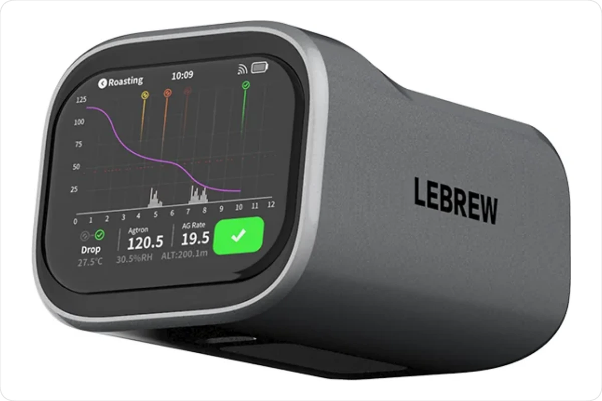
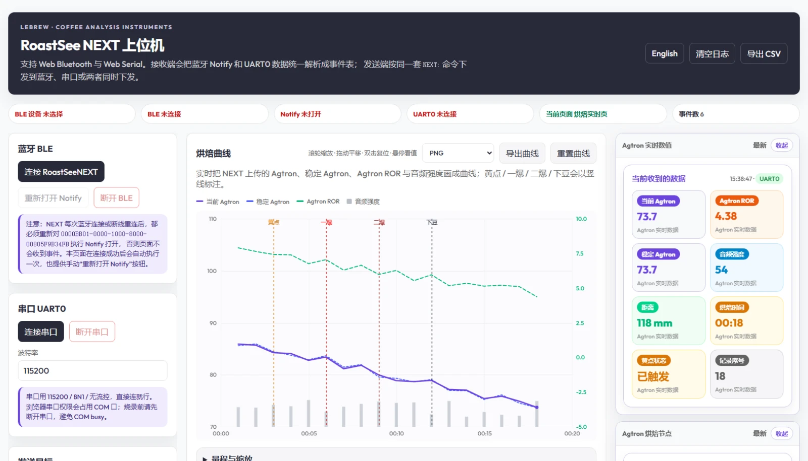
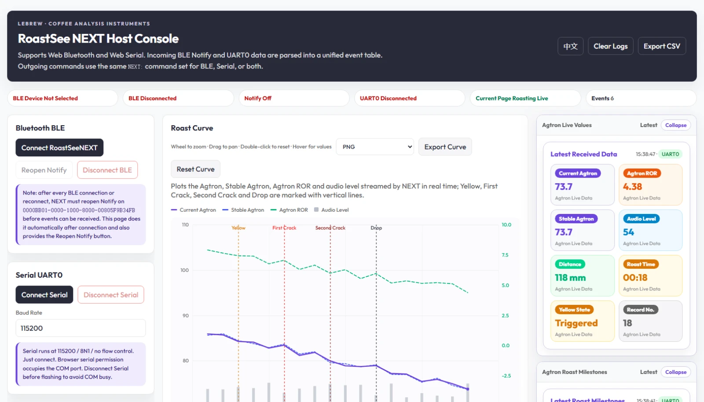
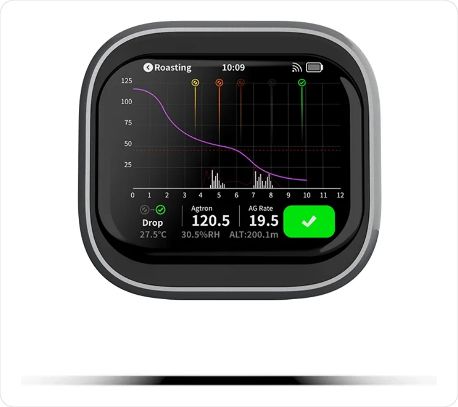
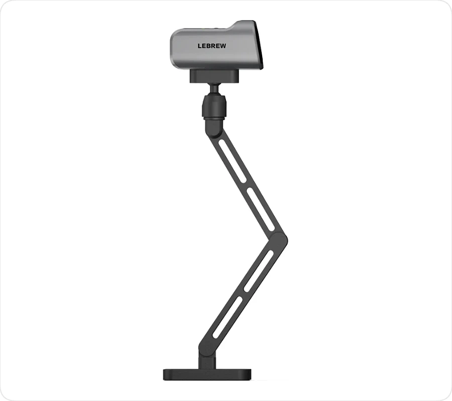

<sub>LEBREW · Coffee Analysis Instruments</sub>

<h1>RoastSee NEXT 网页上位机</h1>

**在浏览器里连上 RoastSee NEXT：实时烘焙曲线、节点标注、数据导出。单文件、零依赖、无需安装。**

<p>
  
  
  
  
  
  
</p>



## 它是什么

一个跑在浏览器里的 RoastSee NEXT 上位机。用 Web Bluetooth 或 Web Serial 直连仪器，
把 Agtron、稳定 Agtron、Agtron ROR 和音频强度实时画成烘焙曲线，把黄点 / 一爆 / 二爆 / 下豆标成竖线，
并把整炉数据导出成 CSV / JSON / ZIP。

没有后端、没有安装包、没有构建流程：**全部代码就在一个 HTML 文件里**，改完刷新即生效。

## 界面

| 中文 | English |
|---|---|
|  |  |

## 特性

- **双通道采集**：蓝牙 BLE（Notify）与串口 UART0 可二选一或同时使用，接收端把两路数据统一解析成事件表。
- **烘焙曲线**
  - 四条曲线：当前 Agtron、稳定 Agtron、Agtron ROR、音频强度。
  - 黄点 / 一爆 / 二爆 / 下豆自动画竖线标注。
  - 滚轮缩放、拖动平移、双击复位、**悬停读值**（光标指到哪个点就显示那一刻的四个数值）。
  - 量程与精度可自定义：时间 / Agtron / ROR 的上下限与刻度步长，留空即自动。
- **导出**
  - 曲线图片：PNG / JPEG / WebP。
  - 曲线数据：CSV / TSV 是纯数值表（表头 + 数值），MATLAB、pandas、Origin、Excel、gnuplot 都能直接读；JSON 额外带节点信息。
  - 数据包列表：CSV / JSON / ZIP（ZIP 内含 `packets.csv`、`packets.json` 与说明文件，方便直接转发）。
  - 事件表：CSV，时间精度可选秒 / 0.1 秒 / 毫秒。
- **中英双语**：右上角一键切换，或用 `?lang=en` 直接进英文界面。
- **无障碍**：键盘 Tab 有清晰焦点环；表单校验就地提示，不弹对话框。
- **内置模拟器**：没有样机时点“开始实时模拟”，走同一套解析链路，用来预览曲线与导出效果。

## 快速开始

三种方式任选，功能完全一样。

### 1. 直接双击

下载后双击 `next_upper_computer.html`。现代 Chrome 把本地文件也视为安全上下文，
Web Bluetooth 与 Web Serial 都能用（本项目在 Chrome 154 上实测：`navigator.bluetooth.getAvailability()` 返回 `true`，
`navigator.serial.getPorts()` 正常返回数组）。

> 代价：本地文件的授权无法按域名记住，每次连接都要重新选一次设备或串口。

### 2. 本地服务器（推荐日常使用）

双击 `START_HTML_SERVER.cmd`：自动查找本机 Python，在 `http://127.0.0.1:8000` 起本地服务器并打开页面
（端口被占用会自动往后找）。`START_HTML_SERVER_EN.cmd` 直接以英文界面启动。
关闭任务栏里最小化的 `RoastSee NEXT Server` 窗口即停止。

### 3. 静态托管（像正常网站一样）

```bash
git clone https://github.com/LEBREW/RoastSee-NEXT-Console.git
```

整个仓库都是静态文件，丢到任意静态托管即可：GitHub Pages、对象存储（OSS / COS）、自有网站都行。

GitHub Pages 开启方式：仓库 **Settings → Pages → Source** 选 `main` 分支 `/ (root)`，随后访问：

```text
https://<组织或用户名>.github.io/RoastSee-NEXT-Console/
https://<组织或用户名>.github.io/RoastSee-NEXT-Console/?lang=en
```

> 提示：`github.io` 在国内访问不稳定。对外正式使用建议放自有域名或国内对象存储。**仓库需为公开（public），Pages 才能免费使用。**

## 浏览器要求

- 桌面版 **Chrome / Edge**。Web Bluetooth 与 Web Serial 目前只有 Chromium 系实现，Firefox / Safari 不支持。
- 页面必须处于安全上下文：`file://`、`http://127.0.0.1`、`http://localhost`、`https://` 都可以；
  普通 `http://` 的局域网地址（如 `http://192.168.x.x`）不行。
- 首次连接需要在浏览器弹窗里手动授权蓝牙设备或串口。

## 硬件

RoastSee NEXT 是 LeBrew 的烘焙分析仪，负责采集 Agtron 与音频数据；这个上位机负责把数据变成看得懂的曲线。

| 设备端界面 | 安装方式 |
|---|---|
|  |  |

官网：[lebrewtech.com](https://lebrewtech.com) · 产品页：[RoastSee NEXT](https://lebrewtech.com/products/roastsee-next-3)

## 目录结构

```text
.
├─ next_upper_computer.html   应用本体（单文件，全部逻辑）
├─ index.html                 静态托管入口，只做跳转并保留 ?lang=en
├─ START_HTML_SERVER.cmd      一键本地服务器（Windows）
├─ START_HTML_SERVER_EN.cmd   同上，直接进英文界面
├─ 使用指南.md                 面向使用者的完整说明
├─ assets/                    设备图片
├─ screenshots/               界面截图
├─ tests/                     Node 离线回归测试
├─ LICENSE                    MIT
└─ README.md
```

## 开发与测试

测试不需要浏览器，直接从 HTML 里抽出对应模块在 Node 里跑，可离线验证：

```bash
node tests/curve_module_test.mjs   # 曲线：记录、去重、节点、绘制全路径（38 项）
node tests/serial_route_test.mjs   # 串口字节路由：AA55 实时帧不会吞掉纯文本（8 项）
node tests/contrast_scan.mjs       # 配色对比度是否符合 WCAG AA（26 组）
```

前两个脚本用于回归功能，第三个用于回归视觉可读性。

## 通信协议

仓库中包含与 NEXT 通信所需的全部信息，只关心使用的话可以跳过：

- BLE 服务 UUID `000000BB-0000-1000-8000-00805F9B34FB`，特征 UUID `0000BB01-0000-1000-8000-00805F9B34FB`（Notify）。
- `NEXT:` 文本命令表：页面控制、开始 / 停止烘焙、Agtron 测量、历史读取、黄点阈值等。
- 串口实时帧（`AA55` 帧头）的字段布局与解析逻辑。

## 许可

代码以 **MIT** 许可开源，见 [LICENSE](LICENSE)。

`assets/` 与 `screenshots/` 中的产品图片、品牌标识版权归 **LeBrew** 所有，不在 MIT 许可范围内，
仅可用于说明本项目。

---

## English

**A single-file, zero-dependency web console for RoastSee NEXT.**

Open it in Chrome or Edge, connect over Web Bluetooth or Web Serial, and watch the roasting curves
(Agtron, stable Agtron, Agtron ROR, audio level) with Yellow / First Crack / Second Crack / Drop markers.
Zoom with the wheel, pan by dragging, double-click to reset, hover to read values, and export the roast
as PNG / JPEG / WebP or CSV / TSV / JSON. The UI switches between Chinese and English.

Open it three ways, all equivalent: double-click `next_upper_computer.html` (modern Chrome treats `file://`
as a secure context), run `START_HTML_SERVER.cmd` for a local server, or host the folder on any static host
(GitHub Pages, object storage, your own site).

Requires desktop Chrome or Edge. Run the offline tests with `node tests/*.mjs`.

Code is MIT licensed. Product photos and brand marks are (c) LeBrew.